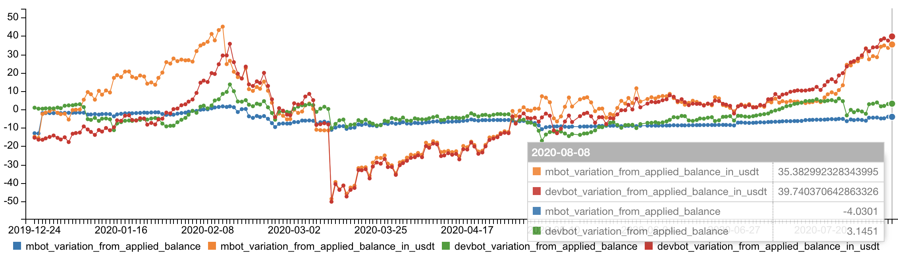

# Correlação, Volatilidade e Dólar

### Rentabilidade dos bots em BTC e USDT

*Para mais detalhes, [acesse o gráfico](https://share.sqltabs.com/api/1.0/docs/ad96516ba236a8207adac0256526048d).*

    <iframe src="https://share.sqltabs.com/api/1.0/docs/9a366c130592c8dd8357177a27b53b42" scrolling="no" width="100%" height="100%" align="center" frameborder="0">
    </iframe>

---

*Publicado em 08 de Agosto de 2020*
